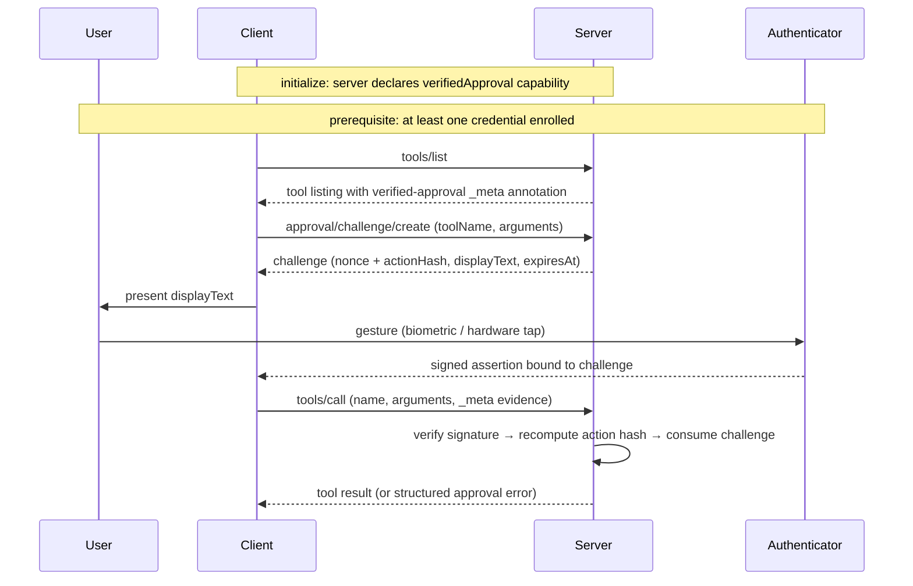

# SEP-0000: Per-Call Passkey Verified Approval for MCP Tool Calls

- **Status**: Draft
- **Type**: Standards Track
- **Created**: 2026-05-02
- **Author(s)**: Paul Pini Sherbaum (@pinialt)
- **Sponsor**: None (seeking sponsor)
- **PR**: https://github.com/modelcontextprotocol/modelcontextprotocol/pull/0000

## Abstract

The Model Context Protocol provides advisory tool annotations and session-level authorization, but no mechanism for cryptographically binding a user-verified authenticator gesture to a specific tool invocation with specific arguments. For tool calls with high-stakes consequences — placing trades, deploying infrastructure, deleting data — a confirmation rendered by a potentially compromised client is insufficient: the same client or agent that issues the call can fabricate the approval gesture without meaningful human authorization.

This proposal introduces per-call verified approval. Tools mark themselves as requiring approval via the `_meta` annotation under the `io.modelcontextprotocol/verified-approval` key. Before invoking such a tool, the client requests a server-issued challenge whose value includes a hash of the canonicalized arguments. The user authorizes the call through a WebAuthn assertion bound to that challenge. The server independently verifies the signature, recomputes the action hash from the actual tool-call arguments, and rejects mismatches. The ceremony composes additively with existing MCP primitives: OAuth Authorization remains session-level; tool annotations remain advisory unless this proposal's annotation is present; elicitation remains the mechanism for routine and out-of-band data flows.

The proposal delivers cryptographically verified argument-binding, freshness, and single-use enforcement. It does not, on its own, defend against display-tampering attacks on synced credentials (per-call gestures may occur on the same device the client controls); the Security Implications section documents this residual risk and proposes future work. The reference implementation includes hardware-tested end-to-end ceremony, server-side verification, and a discriminated-outcome client API.

## Motivation

### 3.1 The threat surface

A tool that places trades. A tool that deletes files. A tool that deploys to production. A tool that transfers money. These calls share a property: the wrong invocation is not a wrong answer the user can ignore — it is a state change that has already happened by the time anyone notices. For tools in this class, per-call human consent is reasonable.

The most common UX for that consent is a confirmation dialog rendered by the MCP client: a modal that names the tool, summarizes the arguments, and waits for a click. As an enforcement primitive, the dialog collapses under several common conditions:

- **Auto-approve modes**, where the user has pre-approved sessions of arbitrary tool use — the dialog never appears.
- **Compromised clients**, where the agent driving the LLM loop is the same process that owns the dialog and can dismiss it programmatically.
- **Prompt injection**, where a malicious tool output instructs the agent to "click yes" and the agent complies as if a user had.
- **Habitual confirmation**, where a user has clicked yes hundreds of times and clicks yes again without reading.

In each case, the client or agent that issues the call can simulate approval that the human did not meaningfully provide.

### 3.2 What MCP currently provides, and why each is insufficient

#### 3.2.1 Tool annotations (destructiveHint, etc.)

The MCP base spec defines tool annotations — `destructiveHint`, `readOnlyHint`, `idempotentHint`, `openWorldHint` — as advisory hints. The spec gives clients no obligation to surface them and no normative behavior tied to them. They are a UI affordance: a destructive-tool icon, a confirmation prompt the client may or may not render. These annotations serve their intended purpose. The verified-approval annotation introduced by this proposal (§4.2) is a separate mechanism that addresses a different threat model.

#### 3.2.2 OAuth Authorization

The MCP [authorization spec](https://modelcontextprotocol.io/specification/draft/basic/authorization) defines session-level authorization: the user authorizes the client→server connection once, the client receives an access token, and subsequent tool calls present that token. There is no per-call human-consent mechanism. Once authorized, a client can invoke any tool the server exposes any number of times without further user interaction. Authorization answers "may this client connect" — not "did the user approve this call."

#### 3.2.3 Step-up authorization

The authorization spec includes a step-up flow: a tool call may return `403` with `insufficient_scope`, prompting the client to re-authorize for additional scopes. Step-up changes the *scope* the session holds, not the *individual approvals* within it. Once stepped up to `files:write`, the client can perform any number of file writes with no further interaction. The granularity is sustained access, not single actions.

#### 3.2.4 Elicitation, form mode

The MCP [elicitation spec](https://modelcontextprotocol.io/specification/2025-11-25/client/elicitation) defines a form mode for collecting structured input from the user through the client: a username, a date range. The spec explicitly forbids form-mode elicitation for sensitive data such as passwords or credentials. Form mode is a routine-input mechanism, not an approval mechanism, and the data passes through the same client whose trustworthiness is in question.

#### 3.2.5 Elicitation, URL mode

URL-mode elicitation is the closest existing primitive. It directs the user to an external URL for sensitive interactions that "must not pass through the MCP client" — authentication redirects, payment flows, credential collection. It differs structurally from per-call approval in three ways. First, it collects information *into* the server (credentials entered into a webpage), while per-call approval collects consent *for an action out of* the server. Second, it produces no argument-binding: the resulting token is reusable across subsequent calls, with no protocol-level tie between one authorization and one tool invocation. Third, it requires the server to host an externally reachable URL, while per-call approval works for any MCP server, including stdio-only servers. The two address adjacent but distinct problems and can coexist.

### 3.3 The specific gap

The gap is precise: per-call, argument-bound, cryptographically verified human approval. Each word rules out a different existing primitive. *Per-call* rules out OAuth and step-up authorization, which grant sustained access whose granularity is the session or the scope, not the invocation. *Argument-bound* rules out URL-mode elicitation, which can authenticate a user but cannot tie the result to a specific tool call with specific arguments. *Cryptographically verified* rules out tool annotations and form-mode elicitation, neither of which produces a signature the server can check. *Human approval* rules out anything signed by the agent itself, by an automated token, or by software-only flows with no separate human gesture. No existing MCP primitive satisfies all four conditions.

### 3.4 Why it matters now

The landscape that motivates this gap has shifted. MCP servers now connect LLM agents to financial APIs, cloud infrastructure, file systems, payment processors, internal datastores, and outbound communication channels. The blast radius of a compromised agent is no longer "wrong text generated" — it is money moved, infrastructure modified, customer data deleted, messages sent under the user's identity. Prompt injection has matured into a routine operational concern: tool outputs are untrusted input, and any guidance an agent reads from a tool result is potentially adversarial. The combination of higher-stakes tools and untrusted outputs means MCP deployments increasingly operate under a threat model that includes adversarial input during autonomous execution.

The gap has been recognized in prior community discussion. Discussions #581, #594, and #668 gesture at it from different angles — questions about cryptographic approval primitives, runtime authorization for sensitive actions, and the distinction between discovery filtering and execution-time consent. A more recent proposal at #689 (Secure Model Context Protocol) addresses agent identity and capability scoping with per-call envelope signatures from the agent's ephemeral key — a complementary security primitive that does not certify human consent. SMCP and per-call human approval compose cleanly: the former proves which agent is making a call; the latter proves which human approved it. The gap — cryptographically signed approvals from the human, not the agent — has remained open through subsequent MCP security proposals.

The rest of this document defines the mechanism. The Specification section defines a tool-side annotation that marks a tool as requiring approval, a server-issued challenge whose value includes a hash of the canonicalized arguments, a WebAuthn ceremony that produces a signature bound to that challenge, and server-side verification that recomputes the action hash from the actual call and rejects on mismatch. The proposal is structurally additive: tools that do not carry the annotation behave exactly as they do today, and clients that do not implement the ceremony interact with non-annotated tools exactly as they do today. The new behavior applies only when the annotation is present.

## Specification

### 4.1 Overview of the ceremony

The verified-approval ceremony binds a single tool invocation to a fresh, server-issued challenge that the user signs through a WebAuthn authenticator. This subsection describes the end-to-end flow; later subsections specify the wire formats, methods, and verification rules.

The flow assumes the server has registered at least one tool whose listing carries the verified-approval annotation (§4.2), the server has declared the `verifiedApproval` capability in its `initialize` response (§4.3), and the user has previously enrolled at least one credential through the enrollment ceremony (§4.4).

When an agent or user requests invocation of an annotated tool, the client requests a challenge from the server via `approval/challenge/create` (§4.4.3), supplying the tool name and the proposed arguments. The server canonicalizes the arguments, computes an action hash bound to `(toolName, canonicalArguments, serverId)` per §4.6, allocates a single-use challenge identifier with an expiration time, and returns a challenge envelope. The wire challenge bytes — those the authenticator signs over — encode a fresh nonce concatenated with the action hash. The envelope around these bytes additionally carries `displayText` describing the action, an `expiresAt` timestamp, and the WebAuthn `requestOptions` the client passes to the browser API.

The client presents `displayText` to the user verbatim and invokes a WebAuthn assertion. The user authenticates through whatever gesture the authenticator requires — a biometric, a hardware key tap, or equivalent — producing a signed assertion bound to the wire challenge bytes. The client then invokes `tools/call` with the original arguments and the assertion carried in `params._meta["io.modelcontextprotocol/verified-approval"]` per §4.5.

The server is the verifier. On receiving the call, the server independently performs three checks: (a) it verifies the WebAuthn signature against the public key of the credential identified in the assertion response, (b) it recomputes the action hash from the actual call arguments and confirms it matches the hash committed to in the issued challenge, and (c) it atomically consumes the challenge so it cannot be replayed. The order matters: verification precedes consumption, so a call presenting an invalid signature does not consume the challenge it claims to bind. Only after all three checks succeed does the server execute the tool. Any failure rejects with the structured error of §4.10 and the tool is not executed.



The ceremony delivers three load-bearing properties. The signature certifies the specific canonicalized arguments (*argument-binding*), so swapping arguments between the user gesture and the server call fails verification. Challenges expire and are single-use (*freshness*), so a captured assertion cannot be reused beyond its issued challenge. The tool's declared authenticator class is enforced at enrollment and at challenge issuance (*capability filtering*). §8 documents the threat-model boundaries of these properties and the known residual risks.

### 4.2 Tool annotation: `tool._meta["io.modelcontextprotocol/verified-approval"]` shape

A server marks a tool as requiring verified approval by setting a value at the namespaced `_meta` key `"io.modelcontextprotocol/verified-approval"` on the tool's listing entry. The value has the following shape:

```typescript
interface VerifiedApprovalToolMeta {
  required: "verified";
  authenticatorClass?: "cross-platform" | "platform";
}
```

`required: "verified"` is the literal string that marks the tool as gated. `authenticatorClass`, when present, declares which class of credentials the tool accepts; the semantics of each class are specified in §4.7.

A tool listing carrying this annotation looks as follows on the wire:

```json
{
  "name": "delete_resource",
  "title": "Delete resource",
  "description": "Permanently delete the resource with the given id.",
  "inputSchema": {
    "type": "object",
    "required": ["resourceId"],
    "additionalProperties": false,
    "properties": {
      "resourceId": { "type": "string", "minLength": 1 }
    }
  },
  "_meta": {
    "io.modelcontextprotocol/verified-approval": {
      "required": "verified",
      "authenticatorClass": "cross-platform"
    }
  }
}
```

Normative requirements:

- Servers MUST set `required` to the literal string `"verified"` when the tool requires verified approval. Future versions of this specification MAY define additional values.
- The `authenticatorClass` field is OPTIONAL. When omitted, clients and servers SHOULD treat the policy as `"cross-platform"`.
- Clients MUST treat tools without this annotation as not requiring verified approval; the tool is invoked as any other tool would be, with no additional ceremony.
- Servers MAY include additional fields under the `"io.modelcontextprotocol/verified-approval"` namespace key for forward compatibility. Clients MUST NOT reject the annotation because of unknown sibling fields and MUST tolerate them.

### 4.3 Capability declaration in `initialize`

Servers that support the verified-approval extension MUST declare the capability in their `initialize` response. The capability lives under the `extensions` slot of `ServerCapabilities` at the bare key `"verifiedApproval"`:

```json
{
  "capabilities": {
    "tools": {},
    "extensions": {
      "verifiedApproval": {}
    }
  }
}
```

The capability key inside `extensions` is the bare string `"verifiedApproval"` — not the reverse-DNS form used for the `_meta` annotation key. The asymmetry between the closed `extensions` namespace and the open `_meta` namespace is documented in `docs/DECISIONS.md` ("Capability declaration placement under `extensions`"). The empty-object value is the initial declaration shape; future versions of this specification MAY define sub-fields under it.

Normative requirements:

- A server that registers any tool carrying the verified-approval annotation MUST declare this capability in its `initialize` response.
- A server MAY declare the capability without yet having registered any approval-required tool — for example, in implementations where tools are loaded dynamically post-`initialize`.
- Declaring the capability commits the server to understanding the methods defined in §4.4 (`approval/enroll/begin`, `approval/enroll/finish`, `approval/challenge/create`) and to accepting and verifying the request-side evidence shape defined in §4.5.
- Clients MUST tolerate unknown sub-fields under the capability value without rejecting the declaration.
- A tool listing carrying this annotation while its server has not declared the capability is a server-side inconsistency. Clients SHOULD log this and MAY refuse to invoke the tool. Servers MUST NOT register approval-required tools without declaring the capability.
- If a client invokes an approval-required tool against a server that declared this capability without including evidence at `params._meta["io.modelcontextprotocol/verified-approval"]`, the server MUST reject the call with the structured error specified in §4.10 (the missing-evidence reason).

### 4.4 New methods

This proposal introduces three JSON-RPC methods following the standard MCP method-naming convention — slash-separated, no reverse-DNS prefix because they are spec-level methods rather than vendor extensions. The methods form two ceremonies: *enrollment* (`approval/enroll/begin` and `approval/enroll/finish`, run once per credential) and *challenge issuance* (`approval/challenge/create`, run before each annotated tool call). All three require the server to have declared the verified-approval capability per §4.3; a server that has not declared the capability MUST respond with JSON-RPC error `-32601` ("Method not found") to any of these methods.

#### 4.4.1 `approval/enroll/begin`

This method initiates WebAuthn credential registration. The server constructs the WebAuthn `PublicKeyCredentialCreationOptionsJSON` object that the client passes to `navigator.credentials.create()`.

**Request.** This method takes no parameters. The `params` field, if present, MUST be ignored.

**Response.** A single field `options` carrying the WebAuthn creation options:

```json
{
  "options": {
    "rp": { "id": "example.com", "name": "Example RP" },
    "user": {
      "id": "<base64url userHandle>",
      "name": "alice@example.com",
      "displayName": "Alice"
    },
    "challenge": "<base64url 32-byte registration challenge>",
    "pubKeyCredParams": [{ "type": "public-key", "alg": -7 }],
    "timeout": 300000,
    "attestation": "none",
    "excludeCredentials": [
      { "type": "public-key", "id": "<base64url credentialId>", "transports": ["usb"] }
    ],
    "authenticatorSelection": {
      "residentKey": "preferred",
      "userVerification": "required"
    }
  }
}
```

Fields under `options` follow the WebAuthn Level 3 specification ([https://www.w3.org/TR/webauthn-3/](https://www.w3.org/TR/webauthn-3/)) for `PublicKeyCredentialCreationOptionsJSON`. This proposal constrains a subset of those fields; the rest are at the server's discretion.

Normative requirements:

- Servers MUST issue a fresh registration challenge per call. Reusing a challenge across calls is a protocol violation.
- Servers MUST track the registration challenge so the corresponding `approval/enroll/finish` call can verify against it.
- Servers MUST set `authenticatorSelection.userVerification` to `"required"` so a presence-only authenticator gesture cannot complete enrollment.
- Servers SHOULD set a TTL on the registration challenge; if unstated, implementations SHOULD default to 5 minutes.
- The response MUST include `excludeCredentials` listing the user's already-enrolled credential IDs — an empty array if no credentials are enrolled. This causes the WebAuthn layer in the browser to refuse re-enrollment of the same authenticator before reaching the server. Server-side defense-in-depth against `excludeCredentials` bypass is specified in §4.4.2.

#### 4.4.2 `approval/enroll/finish`

This method completes WebAuthn credential registration. The client sends the registration response from `navigator.credentials.create()`; the server verifies it against the challenge issued by the corresponding `approval/enroll/begin` call and, on success, persists the new credential.

**Request.** A `params` object with a single `response` field carrying the WebAuthn registration response (`PublicKeyCredentialAttestationResponseJSON` per the WebAuthn Level 3 spec):

```json
{
  "response": {
    "id": "<base64url credentialId>",
    "rawId": "<base64url credentialId>",
    "type": "public-key",
    "response": {
      "clientDataJSON": "<base64url>",
      "attestationObject": "<base64url>",
      "transports": ["usb"]
    },
    "authenticatorAttachment": "cross-platform",
    "clientExtensionResults": {}
  }
}
```

**Response.** A confirmation object identifying the newly-stored credential:

```json
{
  "success": true,
  "credentialId": "<base64url credentialId>",
  "createdAt": "<ISO-8601 timestamp>"
}
```

Normative requirements:

- Servers MUST verify the registration response against the challenge issued by the corresponding `approval/enroll/begin`. Mismatched challenges MUST be rejected.
- Servers MUST verify that the authenticator performed user verification. A credential whose registration response did not assert UV MUST be rejected.
- Servers MUST verify the registration response is well-formed and that its embedded signature is valid. Servers using `attestation: "none"` MUST still perform this verification — `"none"` waives only the requirement to validate the attestation issuer's identity, not the requirement to verify the response itself.
- Servers MUST persist the credential's `publicKey`, `credentialId`, `counter`, `transports`, and `userHandle` for use during subsequent assertions.
- Servers MUST reject registration if the `credentialId` is already enrolled. This is server-side defense-in-depth: the WebAuthn-layer `excludeCredentials` enforcement at the browser is bypassable when the attestation does not sign over `clientDataJSON`, so the server MUST independently check for re-enrollment after WebAuthn verification but before persisting the new record. Reject with the structured error from §4.10 (the credential-already-enrolled reason).
- Servers MUST reject registration if the registration challenge has expired or has already been consumed.

#### 4.4.3 `approval/challenge/create`

This method is invoked by the client immediately before each call to a tool requiring verified approval. The server constructs a challenge envelope binding the proposed call's arguments to a fresh nonce; the envelope contains the WebAuthn `PublicKeyCredentialRequestOptionsJSON` the client passes to `navigator.credentials.get()`.

**Request.** A `params` object with two fields:

- `toolName`: the name of the tool to be invoked.
- `arguments`: the proposed arguments object.

```json
{
  "toolName": "delete_resource",
  "arguments": { "resourceId": "abc123" }
}
```

**Response.** A challenge envelope:

```json
{
  "challengeId": "<server-issued opaque identifier>",
  "displayText": "Permanently delete resource abc123",
  "expiresAt": "<ISO-8601 timestamp>",
  "requestOptions": {
    "challenge": "<base64url 64-byte (nonce || actionHash)>",
    "rpId": "example.com",
    "allowCredentials": [
      { "type": "public-key", "id": "<base64url credentialId>", "transports": ["usb"] }
    ],
    "userVerification": "required",
    "timeout": 60000
  }
}
```

Field semantics:

- `challengeId`: an opaque server-issued identifier; the client echoes it back in the evidence on `tools/call` (§4.5). Used by the server to look up the pending challenge state at verification time.
- `displayText`: a human-readable description of the action being approved. The client SHOULD present this verbatim to the user in the approval surface.
- `expiresAt`: an ISO-8601 timestamp after which the challenge is no longer accepted.
- `requestOptions`: the WebAuthn `PublicKeyCredentialRequestOptionsJSON` for the client to pass to `navigator.credentials.get()`. The `challenge` field encodes the wire challenge bytes — `nonce || actionHash` — that the authenticator signs over.

Normative requirements:

- Servers MUST verify that the named tool is registered with the verified-approval annotation per §4.2. If not, reject with the appropriate structured error from §4.10.
- Servers MUST canonicalize the supplied arguments per §4.6 before computing the action hash.
- Servers MUST compute the action hash from `(toolName, canonicalArguments, serverId)` per §4.6.
- Servers MUST construct the wire challenge bytes as `nonce || actionHash` — a 32-byte fresh nonce concatenated with the 32-byte action hash — and base64url-encode them into `requestOptions.challenge`.
- The nonce MUST be cryptographically random (drawn from a CSPRNG) and MUST be unique across all challenges issued by the server. Predictable or repeated nonces compromise the freshness property defined in §8.2.2.
- Servers MUST associate the challenge server-side with the tuple `(toolName, canonicalArguments, serverId)` so the verification rules in §4.8 can recompute and compare at call time.
- Servers SHOULD set `expiresAt` no further in the future than a server-defined TTL; if unstated, implementations SHOULD default to 60 seconds.
- Servers MUST populate `requestOptions.allowCredentials` with the user's enrolled credentials filtered by the tool's `authenticatorClass` policy per §4.7.
- Servers MUST set `requestOptions.userVerification` to `"required"`.
- Servers MUST construct `displayText` from a server-side describe function applied to the supplied arguments. The `displayText` MUST be human-readable and accurately describe the action being approved. This is security-relevant — the user's understanding of what they are signing depends on it matching the action hash bound by the same call. See §8 on display tampering for the threat-model boundaries of this guarantee.
- Clients MUST present `displayText` to the user verbatim before invoking the WebAuthn assertion. The `displayText` is the human-readable surface through which the user reviews the action that the action hash will bind; transformations of it (truncation, paraphrasing, omission) defeat the human-understanding property the proposal targets without changing the cryptographic binding.

### 4.5 Evidence on `tools/call`: `params._meta["io.modelcontextprotocol/verified-approval"]`

When invoking a tool whose listing carries the verified-approval annotation, the client MUST attach the WebAuthn assertion in the request's `_meta` field at the namespaced key `"io.modelcontextprotocol/verified-approval"`. The value at this key has the shape:

```typescript
interface ApprovalEvidence {
  method: "webauthn";
  challengeId: string;
  response: AuthenticationResponseJSON;
}
```

Field semantics:

- `method`: the discriminator identifying the assertion family. Today the only conformant value is `"webauthn"`. Future versions of this specification MAY define additional values.
- `challengeId`: the identifier from the matching `approval/challenge/create` response. Used by the server to look up the pending challenge state.
- `response`: the WebAuthn `PublicKeyCredentialAuthenticationResponseJSON` produced by `navigator.credentials.get()`, unmodified.

A complete `tools/call` request carrying evidence:

```json
{
  "method": "tools/call",
  "params": {
    "name": "delete_resource",
    "arguments": { "resourceId": "abc123" },
    "_meta": {
      "io.modelcontextprotocol/verified-approval": {
        "method": "webauthn",
        "challengeId": "<challengeId from approval/challenge/create>",
        "response": {
          "id": "<base64url credentialId>",
          "rawId": "<base64url credentialId>",
          "type": "public-key",
          "response": {
            "clientDataJSON": "<base64url>",
            "authenticatorData": "<base64url>",
            "signature": "<base64url>",
            "userHandle": "<base64url>"
          },
          "authenticatorAttachment": "cross-platform",
          "clientExtensionResults": {}
        }
      }
    }
  }
}
```

Normative requirements:

- Clients MUST include this evidence in `params._meta` for every call to a tool that carries the verified-approval annotation.
- Clients MUST set `method` to the literal string `"webauthn"`.
- Clients MUST set `challengeId` to the value received from the immediately preceding `approval/challenge/create` for the same tool and arguments. Each `challengeId` is bound to exactly one `tools/call` invocation; a client that submits the same `challengeId` in two distinct `tools/call` requests is in protocol violation, and the server's single-use enforcement (§4.8) will reject the second submission with the appropriate structured error from §4.10.
- Clients MUST forward the WebAuthn assertion response unmodified.
- Servers MUST verify the evidence per the verification rules in §4.8 before executing the tool.
- Servers MUST reject the call with the structured error from §4.10 when evidence is missing, malformed, or fails any verification step.
- Servers MUST NOT execute the tool if any verification step fails.

### 4.6 Argument canonicalization (RFC 8785) and action-hash construction

This proposal uses RFC 8785 (JSON Canonicalization Scheme, JCS) for argument canonicalization. JCS produces a single, deterministic byte sequence for any JSON value, with sorted object keys, normalized number serialization, and UTF-8 NFC normalization where applicable. Both client and server MUST use RFC 8785 verbatim — implementation-specific variants of "deterministic JSON" are non-conformant.

Canonicalization is applied to the arguments object as received in the request — the same logical JSON value the client sent, normalized through JCS to a deterministic byte sequence. Both client and server MUST canonicalize the same logical value: the client constructs the proposed arguments, canonicalizes them once for the challenge request, and forwards those same arguments unchanged on the subsequent `tools/call`. Servers MUST NOT apply schema defaults, type coercions, or other transformations between canonicalization and action-hash computation; the user signs for what the canonical bytes describe, not for some downstream-validated form of it.

The action hash binds three inputs — the tool name, the canonicalized arguments, and the per-server identifier — into a single 32-byte SHA-256 digest:

```
actionHashBytes = SHA-256( utf8(toolName) || 0x00
                           || utf8(canonicalArgsJson) || 0x00
                           || utf8(serverId) )                  // 32 bytes
```

The 0x00 byte separates the three fields. A 0x00 byte cannot appear inside a valid UTF-8 identifier or inside JCS output of a JSON value, so the separator is unambiguous: no input could blur the boundaries between fields. The wire challenge bytes (`nonce || actionHash`, base64url-encoded into the WebAuthn challenge field) are constructed per §4.4.3.

The action hash binds three inputs because two of them — the tool name and the arguments — are not unique across servers. A user might enroll the same WebAuthn credential with multiple MCP servers; without a per-server discriminator, a `delete_resource` challenge from server A could be replayed against server B if both expose a tool with that name. `serverId` is that discriminator: an implementation-internal value, not a wire field. Servers MUST use a serverId value that is unique across all servers a credential might be enrolled with. Suitable choices include the server's OAuth issuer URL, a stable URL identifier, or a UUID generated at first initialization and persisted across restarts. A constant default value (e.g., `"mcp-default"`) is non-conformant: two servers using the same default produce identical action hashes for identical (toolName, arguments) tuples, enabling cross-server replay.

Normative requirements:

- Both client and server MUST use RFC 8785 (JCS) for argument canonicalization.
- Both MUST use SHA-256 for the action hash.
- The action hash MUST be computed as `SHA-256(utf8(toolName) || 0x00 || utf8(canonicalArgsJson) || 0x00 || utf8(serverId))` with the 0x00 byte as separator.
- Servers MUST keep `serverId` stable across the lifetime of issued challenges; rotating `serverId` while challenges are pending invalidates them.
- Servers MUST use a serverId value unique across all servers a credential might be enrolled with. Constant default values are non-conformant.
- Canonicalization MUST be applied to the arguments object as received in the request. Servers MUST NOT apply schema defaults, type coercions, or other transformations to the arguments between canonicalization and action-hash computation.

### 4.7 Authenticator class policy: capability filter

The verified-approval annotation's optional `authenticatorClass` field declares which class of credentials the tool accepts. Two values are defined:

- `"cross-platform"` (the default when `authenticatorClass` is omitted): credentials whose stored transports include at least one of `hybrid`, `usb`, `nfc`, or `ble` are eligible. Credentials whose transports are exclusively `["internal"]` (same-device-only authenticators such as platform biometrics) are excluded.
- `"platform"`: any enrolled credential is eligible, including same-device-only authenticators.

The filter is applied at challenge-issuance time, via the `allowCredentials` list on the WebAuthn assertion options. Credentials whose stored transports do not satisfy the policy are excluded from `allowCredentials`, so the browser will not invoke them for signing.

Enrollment is per-user, not per-tool: a single credential pool serves all of a user's annotated tools, which may declare different `authenticatorClass` values. The server MUST capture and persist each credential's transports at enrollment-finish time so the per-tool filter can be applied at challenge-issuance. Enrollment itself does not constrain which authenticator class a user may register; that decision is deferred to challenge time, where the per-tool policy is known.

This is a CAPABILITY filter, not a use-time guarantee. The cross-platform policy excludes credentials advertised as same-device-only; it does not constrain which device the user actually signs on. With synced-credential providers (iCloud Keychain, Google Password Manager, etc.), a credential whose transports include both `"hybrid"` and `"internal"` is locally usable on the device hosting the client, and the OS picker may present the local presentation path regardless of server-issued WebAuthn hints. The cross-platform filter correctly excludes credentials whose transports advertise only `["internal"]`. It does not exclude credentials whose transports advertise `["hybrid", "internal"]` — even when the OS picker may present those credentials via the local device path. Synced-credential providers (iCloud Keychain, Google Password Manager) typically advertise `["hybrid", "internal"]` because the credential is reachable via cross-device flows OR locally; the filter, applied to the advertised transports, cannot distinguish which of those paths the user will actually take. Mitigating display-tampering on synced credentials requires platform-side changes (per-call attestation of the transport actually used at sign time, out-of-band confirmation channels, etc.) and is documented as Future Work in §8.4.

Normative requirements:

- When `authenticatorClass` is `"cross-platform"` or omitted, servers MUST exclude credentials from `allowCredentials` whose stored transports are exclusively `["internal"]`.
- When `authenticatorClass` is `"platform"`, servers MUST accept any enrolled credential.
- Servers MUST apply the `authenticatorClass` filter at challenge-issuance time when constructing `allowCredentials`. Servers MUST persist each credential's transports at enrollment-finish (per §4.4.2) so the filter has the data it needs.
- The filter has no client-side normative requirement; clients are not expected to participate in or replicate the policy check.

### 4.8 Server verification rules (normative MUST list)

Servers MUST perform the following checks in order when handling a `tools/call` request to a tool carrying the verified-approval annotation. Each check has a corresponding §4.10 reason; on failure, the server MUST reject with that reason and MUST NOT proceed to subsequent checks.

1. Evidence MUST be present at `params._meta["io.modelcontextprotocol/verified-approval"]`. Missing → `missing_evidence`.
2. Evidence MUST be a well-formed object with `method`, `challengeId`, and `response`. Malformed → `missing_evidence`.
3. `evidence.method` MUST be `"webauthn"`. Other → `unsupported_method`.
4. The challenge `evidence.challengeId` MUST be known. Unknown → `challenge_unknown`.
5. The challenge MUST NOT have been consumed. Consumed → `challenge_consumed`.
6. The challenge MUST NOT have expired (current time < `expiresAt`). Expired → `challenge_expired`.
7. The challenge MUST have been issued for the tool currently being invoked. Mismatch → `challenge_wrong_tool`.
8. The credential `evidence.response.id` MUST be enrolled. Unknown → `unknown_credential`.
9. The credential's transports MUST satisfy the tool's `authenticatorClass` policy per §4.7. Mismatch → `authenticator_class_mismatch`.
10. The WebAuthn signature MUST verify against the credential's stored public key. Failed → `signature_verification_failed`.
11. The credential's signCount MUST be strictly greater than the stored counter when the stored counter is greater than zero. A stored counter of zero disables this check; this accommodates synced credentials (e.g., iCloud Keychain passkeys) that report counter values of zero indefinitely. When this check is disabled, the protocol relies on the remaining verification steps for clone resistance — argument-binding, single-use, and authenticator-class filtering still apply, but counter-based clone detection does not. Regression → `signature_counter_regression`.
12. The action hash recomputed from `(toolName, canonicalArguments, serverId)` per §4.6 MUST equal the action hash committed in the issued challenge. Mismatch → `argument_hash_mismatch`.
13. The challenge MUST be atomically consumed after all preceding checks succeed. Consume-then-verify implementations are non-conformant — a captured assertion replayed against a still-valid challenge would consume the challenge before the failing verification surfaces, leaving the legitimate next call unable to use it.
14. The credential's stored counter MUST be updated to the value reported in the assertion.

The order of these checks is normative for steps 1-13. Verification (1-12) MUST precede consumption (13). The challenge-state checks (4-7) follow the order unknown → consumed → expired → wrong-tool to give callers the most specific reason available.

Successful completion of steps 1-14 produces the verified-approval primitive's deliverable: a binary attestation that this specific call is authorized. The tool's execution itself is NOT part of this ceremony. The caller — typically the server's `tools/call` handler — is responsible for invoking the tool's execute handler only after verification returns successfully. This separation makes clear what the proposal delivers (authorization for a specific call) and what it does not (the execution itself, which has its own failure modes outside this proposal's scope).

### 4.9 Client behavior rules (normative MUST list)

This subsection consolidates client-side normative requirements introduced in earlier subsections; cross-references identify the originating subsection.

- Clients MUST detect tools carrying the verified-approval annotation per §4.2.
- Clients MUST NOT invoke an approval-required tool without first requesting a challenge via `approval/challenge/create` per §4.4.3.
- Clients MUST present `displayText` to the user verbatim before invoking the WebAuthn assertion per §4.4.3. The `displayText` is the human-readable surface through which the user reviews the action that the action hash will bind; transformations of it (truncation, paraphrasing, omission) defeat the human-understanding property the proposal targets without changing the cryptographic binding.
- Clients MUST forward the WebAuthn assertion response unmodified per §4.5.
- Clients MUST attach the assertion evidence at `params._meta["io.modelcontextprotocol/verified-approval"]` on the `tools/call` request per §4.5.
- Clients MUST NOT reuse a `challengeId` across `tools/call` invocations per §4.5; each `challengeId` is bound to exactly one call.
- Clients MUST invoke the WebAuthn assertion only after the user has reviewed `displayText`.
- Clients SHOULD surface §4.10 errors to the user with appropriate context. The specific UX is implementation-defined; this is a SHOULD because the choice of presentation (modal, toast, log entry) depends on the client's broader interface conventions.

### 4.10 Error codes and reasons

All approval-domain rejections use the JSON-RPC error code `-32001`. JSON-RPC 2.0 reserves codes -32000 to -32099 for implementation-defined server errors; this proposal occupies one slot in that range. The error structure follows JSON-RPC convention: a top-level `error` object with `code`, a human-readable `message`, and a structured `data` object containing a `reason` field. The `reason` field is the canonical machine-readable discriminator; clients SHOULD branch on it rather than parsing `message`.

```json
{
  "jsonrpc": "2.0",
  "id": "<request id>",
  "error": {
    "code": -32001,
    "message": "Approval evidence does not match the arguments of this call",
    "data": {
      "reason": "argument_hash_mismatch"
    }
  }
}
```

The `reason` field carries one of the values enumerated below, grouped by the path that emits it.

**Per-call assertion path** (emitted during `tools/call` verification, §4.8):

- `missing_evidence` — evidence is missing from `params._meta` or its shape is malformed.
- `unsupported_method` — `evidence.method` is not `"webauthn"`.
- `challenge_unknown` — `challengeId` does not match any pending challenge.
- `challenge_consumed` — the challenge has already been used.
- `challenge_expired` — the challenge's `expiresAt` has passed.
- `challenge_wrong_tool` — the challenge was issued for a different tool.
- `unknown_credential` — the credential identified in the assertion is not enrolled.
- `authenticator_class_mismatch` — the credential's class does not satisfy the tool's policy.
- `signature_verification_failed` — WebAuthn signature verification failed.
- `signature_counter_regression` — the credential's signCount did not strictly increase.
- `argument_hash_mismatch` — the recomputed action hash does not match the challenge's committed hash.

**Challenge issuance** (emitted by `approval/challenge/create`, §4.4.3):

- `tool_not_approved_required` — challenge requested for a tool not registered as approval-required.
- `no_eligible_credential` — no enrolled credentials satisfy the tool's `authenticatorClass` policy.

**Enrollment finish** (emitted by `approval/enroll/finish`, §4.4.2):

- `credential_already_enrolled` — re-enrollment of an already-enrolled credentialId.
- `no_pending_enrollment` — no `approval/enroll/begin` was called or its challenge expired.
- `verification_failed` — WebAuthn registration verification failed.

Normative requirements:

- Servers MUST use code `-32001` for all approval-domain rejections.
- Servers MUST include a `reason` field in `data` from the enumerated set above.
- Servers MAY include additional fields in `data` for diagnostic purposes (timestamps, counter values, etc.). Clients MUST NOT depend on additional fields beyond `reason`.
- Implementations MAY localize `message`. The `reason` field is the canonical machine-readable identifier and MUST NOT be localized.

### 4.11 Security relationship to existing primitives

Verified approval is structurally additive: it composes with existing MCP primitives without conflict.

**OAuth Authorization** (§3.2.2) and verified approval operate at different layers. OAuth establishes that a client may connect to a server at all (session-level). Verified approval establishes that a specific tool call has been authorized by a specific human-bound credential (per-call, argument-bound). Both apply to every approval-required call: OAuth authenticates the connection; verified-approval evidence authorizes the individual call. Neither replaces the other.

**Step-up authorization** (§3.2.3) escalates session *scope*; verified approval escalates a *single call*. The two are not in conflict — a client MAY step up to gain a broader scope and then perform many calls under it, with only those to verified-approval-annotated tools requiring per-call evidence. Step-up affects what a session may do; verified approval affects which individual actions within a permitted session are authorized.

**Elicitation** (§3.2.4 and §3.2.5) is a routine and out-of-band input mechanism. Form-mode elicitation collects routine input through the client; URL-mode elicitation collects sensitive input out-of-band; verified approval collects per-call human consent for an action. A single server may use all three: elicit routine input via form mode, redirect to a URL for a payment authorization, and require verified approval for the most consequential tool calls. The three address adjacent but distinct problems.

## Rationale

### 5.1 Why `_meta` over annotations

The MCP base specification defines tool annotations — `destructiveHint`, `readOnlyHint`, `idempotentHint`, `openWorldHint` — as advisory hints. Clients are not obligated to surface them; no normative server behavior is tied to them. They exist as UI affordances. The verified-approval annotation is normative: a server that emits it expects the client to perform the ceremony of §4.4 and the call to fail without evidence. Layering a normative requirement into a family the spec defines as advisory would create persistent ambiguity — every reader would need to argue why one annotation is enforced when its siblings are not.

The MCP `_meta` namespace was designed for exactly this case: extension fields that are not part of the base spec but live within its data model. The SDK already uses `_meta` for its own extensions — `progressToken` and `io.modelcontextprotocol/related-task` are namespaced keys on the request-side `_meta`. Layering the verified-approval annotation under `_meta` uses an existing extension point in the way it was intended, rather than overloading an existing field family with a foreign semantic.

### 5.2 Why JCS for canonicalization

Both client and server must produce byte-identical canonicalized output from the same logical arguments object — argument-binding depends on it. "Deterministic JSON" sounds like a settled term, but in practice the ecosystem hosts multiple non-equivalent variants: RFC 8785 (JCS), JSON-LD's URDNA2015, ad-hoc sort-keys-and-stringify implementations, and several library-specific normalizations. Each produces different bytes for the same input. Naming a specific canonicalization scheme disambiguates: the proposal names RFC 8785, and any conformant JCS implementation produces identical bytes regardless of language or runtime.

The reference implementation uses `canonicalize@3.0.0` by Erdtman — the author of RFC 8785. The library is pure ESM with zero runtime dependencies and works in both Node and browser bundles, which matters because the same canonicalization runs in both the server gate and the client ceremony. Conformant alternatives in other languages exist; the spec text names the algorithm, not the library.

### 5.3 Why argument-binding via challenge field, not separate field

The action hash is embedded in the WebAuthn challenge bytes rather than carried as a separate signed field. This is a deliberate use of the WebAuthn signing surface: WebAuthn assertions sign over the challenge value, which is the bytes the server provides and the authenticator passes through to the signing ceremony. Putting the action hash inside the challenge means the WebAuthn signature *is* the argument-binding — there is no separate signing step, no separate field for the server to verify, and no risk that an implementation forgets the second verify and ships a binding-free hole.

A natural alternative would have been to carry the action hash as a separate field on the evidence envelope and have the server verify a separate signature over it. This doubles the cryptographic work — the server verifies the WebAuthn assertion AND a separate signature — and introduces a place where an implementation can be subtly wrong. The "two signatures" pattern is also harder to reason about: under what conditions is the second signature trusted? Under what key? The single-signature design avoids these questions.

The wire challenge is 64 bytes — 32-byte nonce concatenated with 32-byte action hash, encoded as 86 base64url characters — which fits comfortably within the variable-length challenge field WebAuthn Level 3 platforms support.

### 5.4 Why authenticator class is a capability filter, not a use-time guarantee

The authenticator-class field began as a use-time guarantee. Phase 3 intended that tools annotated `authenticatorClass: "cross-platform"` would be signed on a separate device — a phone via WebAuthn's hybrid transport, or a hardware key — moving the user's signing gesture to a surface outside the client's trust boundary. The mechanism was server-side: issue the challenge with `hints: ["hybrid"]`, expect the OS picker to surface only cross-device options.

Empirical testing in Phase 4 showed this is unachievable with WebAuthn Level 3 today. On macOS 26.4.1 with Safari 26.4 and Chrome 147 (May 2026), `hints: ["hybrid"]` is a no-op: Apple's system picker presents the local synced credential regardless of the hint. A credential whose stored transports include both `"hybrid"` and `"internal"` — typical of iCloud Keychain and Google Password Manager passkeys — is locally usable on the device hosting the client, and the OS chooses the local presentation path. The empirical finding is documented in `verification/phase-4-mitigation-1.md`.

Given this finding, the proposal narrows the claim. The authenticator-class field becomes a capability filter at challenge-issuance time: credentials whose transports advertise only `["internal"]` are excluded, correctly barring same-device-only authenticators (platform biometrics, Windows Hello). It does not become a guarantee about which device the user signs on.

The proposal retains the field rather than removing it because the capability filter still excludes a real category at issuance time, future platform changes (per-call attestation of the transport actually used at sign time, or stricter `hints` semantics) could promote the filter to a use-time guarantee without protocol churn, and removing the field and re-adding it later would be a breaking change for tool authors who have already opted into class-aware policies.

### 5.5 Why per-call rather than per-session

Session-level approval primitives — OAuth Authorization (§3.2.2) and step-up (§3.2.3) — cannot bind a signature to a specific call with specific arguments. Once a session holds an access token for some scope, every call within that scope is authorized; there is no point at which the user's authentication binds to "delete the resource at this id" rather than to "any future call to a tool covered by this scope."

Per-call approval changes the granularity. The user's signing gesture certifies one tool invocation with one canonical argument set. A user who has authorized a session for `files:write` has not authorized "delete /etc/passwd"; the second decision is its own signed event, with its own action hash, its own challenge, and its own opportunity for the user to refuse. This is the property §3.3 names as the gap: per-call, argument-bound human approval that no session-level primitive provides.

Per-call approval does not replace session-level authorization; the two compose, as §4.11 describes.

### 5.6 Why method-agnostic envelope with WebAuthn as first profile

The evidence envelope `ApprovalEvidence` (§4.5) is designed as method-discriminated to make future expansion additive. Today the schema permits any string for `method`, and the server enforces conformance at runtime — only `"webauthn"` is accepted; other values are rejected with the `unsupported_method` reason from §4.10. The schema is intentionally permissive on input so the runtime discriminator can produce a precise rejection rather than a generic schema-parse failure.

When a second method profile is defined — a delegated approval session, a hardware-token-only flow, an OIDC step-up bound to per-call evidence — tightening the schema to a discriminated union over the now-multiple conformant values is an additive change. Read sites that already pattern-match on `method` are prepared for the discrimination; nothing needs to widen.

The cost of designing for extensibility was minimal: one literal-string runtime check and one error reason. The cost of retrofitting an undiscriminated envelope later would touch every consumer's read site, every implementation's evidence-parsing code, and every tool author who treats the envelope as fixed-shape.

### 5.7 Considered alternatives and why rejected

The proposal selects WebAuthn over a number of adjacent primitives that solve adjacent problems. Each was considered; none addresses the four-word gap of §3.3.

**TOTP (time-based one-time passwords).** TOTP authenticates a user within a time window — "the person holding this seed at this minute." It is unbound to specific actions: a TOTP code does not certify what the user approved, only that they were present. Using TOTP as an approval primitive collapses to "user is online during this minute," which the agent driving the LLM loop can satisfy at any moment. TOTP is an authentication primitive, not an approval primitive.

**Push notifications (Duo-style).** A push to a registered phone app would let the user see and approve each call on a device the client cannot drive. The mechanism depends on the user having a registered out-of-band channel — a managed app, a working SMS path, an email address routed to a device the user reads. For an MCP server that may run as a stdio binary on a developer's laptop, requiring per-deployment registration of an additional channel is operationally heavy. WebAuthn's "the device the user is on right now" model is lighter-weight for the typical deployment.

**OIDC step-up authentication.** Step-up is session-scoped (§3.2.3): it raises the privileges a session holds, not the authorization on an individual call within the session. Step-up answers "is this user willing to re-authenticate for higher privileges?"; verified approval answers "did this user approve this specific call with these specific arguments?" The two questions have different answers and different threat models.

**Plain elicitation URL mode.** URL-mode elicitation directs the user to a server-hosted URL for sensitive interactions (§3.2.5). It collects information *into* the server (credentials entered into a webpage); the resulting token or stored credential is reusable across subsequent calls. There is no protocol-level tie between one URL-mode authorization and one tool invocation, which is the exact property argument-binding requires.

Each of these primitives is real and useful for its actual purpose. The proposal selects WebAuthn because it produces a cryptographic signature bound to a value the server controls — and that value can carry the action hash.

## Backward Compatibility

Tools without the annotation behave identically to today. The verified-approval annotation is opt-in per tool. A tool whose `_meta` does not include the `"io.modelcontextprotocol/verified-approval"` key is invoked through the standard `tools/call` flow, with no challenge issuance, no WebAuthn ceremony, and no additional evidence shape. Existing servers and clients that never encounter the annotation are unaffected by this proposal.

Clients without ceremony support cannot invoke approval-required tools. A client that does not implement the §4.4 methods or the §4.5 evidence shape fails to invoke any approval-annotated tool: the server returns the §4.10 `missing_evidence` reason. This is the proposal's intended behavior, not a backward-compatibility break. Pre-existing clients that never encounter an annotated tool continue to work; pre-existing clients that newly encounter one fail at the call with a structured reason an updated client can handle.

Servers without the capability declaration cannot register approval-required tools. Per §4.3, a server that registers any approval-required tool MUST declare the `verifiedApproval` capability in its `initialize` response. The capability declaration is the contract that the server supports the methods defined in §4.4 and accepts the evidence shape defined in §4.5. Servers that do not declare the capability MUST NOT register approval-required tools — there is no client-callable path to invoke them, and the inconsistency suggests a server bug.

Migration path: existing tools opt in by adding the annotation. The server author adds `_meta["io.modelcontextprotocol/verified-approval"]` with `required: "verified"` (and optionally `authenticatorClass`), declares the capability per §4.3, and wires the `tools/call` handler to invoke the verified-approval gate before executing the tool. No changes are required to the tool's `inputSchema`, output format, or business logic — the opt-in is metadata-and-wiring at the server layer.

## Security Implications

### 8.1 Threat model

#### 8.1.1 Compromised MCP client (primary)

The MCP client process owns the dialog, drives the LLM loop, and issues `tools/call` requests. A compromised client — by supply-chain attack, runtime takeover, or prompt injection that escapes containment — can dismiss confirmation dialogs, fabricate user input to UI surfaces it controls, and submit arbitrary calls.

Verified approval defends against this threat by moving the user's authorization gesture to a cryptographic signature the compromised client cannot produce. The WebAuthn private key is hardware-isolated from the client's process; the client cannot synthesize a valid assertion without it. The compromised client can refuse to invoke the ceremony, but it cannot fabricate a successful one.

#### 8.1.2 Prompt injection within an honest client

A specific subset of §8.1.1: an honest, well-implemented client whose LLM consumes adversarial content — a malicious tool output, a poisoned RAG document, a hostile web page. The injected content tries to convince the agent to invoke a destructive tool or to suppress confirmation UI.

Verified approval prevents the agent from satisfying the human-consent requirement on its own. The agent can be convinced to attempt the call; the call cannot succeed without a real user gesture against a real authenticator. Prompt injection that aims to "delete all files" reduces to "the agent attempts the call, the user reviews `displayText`, and the protocol enforces refusal absent a valid signature."

#### 8.1.3 Network-layer attackers

An adversary who can observe or modify traffic between client and server is out of scope: transport security is the MCP base spec's responsibility (TLS for HTTPS, OS-level IPC trust for stdio). Verified approval does not add a separate transport-security layer.

That said, an active network attacker who rewrites a `tools/call` body cannot succeed against an approval-required tool. The action hash binds the assertion to specific arguments per §4.6, so rewriting arguments invalidates the signature. The attacker can drop calls or replay them, but replays are caught by the consume-once invariant of §4.8.

#### 8.1.4 Compromised authenticator

If the authenticator itself is compromised — its private key extracted, the device cloned, or biometric gating bypassed — the attacker can produce valid signatures for any challenge they receive. This is the WebAuthn trust root; defending it is outside MCP's scope. The proposal inherits WebAuthn's defense — hardware-isolated keys with attestation, biometric or PIN gating on use — and assumes the authenticator's own threat model.

#### 8.1.5 Malicious server

A server that emits fraudulent challenges, lies about which tools require approval, or otherwise misuses the protocol is out of scope. The user trusts the server they chose to connect to. Verified approval is server-enforced — the server is the verifier — so a malicious server is not a threat verified approval is designed to mitigate. Server-trust questions belong to the broader MCP authorization model.

### 8.2 Properties delivered (with reasoning)

#### 8.2.1 Argument-binding via the challenge construction

The action hash combines the canonical arguments, the tool name, and the server identifier into 32 SHA-256 bytes per §4.6. The hash is concatenated with a fresh 32-byte nonce into the WebAuthn challenge per §4.4.3. The signature certifies the challenge bytes verbatim, which means it certifies the specific canonicalized arguments that produced the hash. Modifying the arguments after signing produces a different hash and a verification failure (§4.8 step 12).

Threat addressed: an attacker who captures a valid assertion cannot reuse it for a different invocation, even of the same tool with different arguments. The signature is bound to one specific `(toolName, canonicalArguments, serverId)` tuple.

#### 8.2.2 Freshness via per-call nonce and TTL

Each `approval/challenge/create` produces a fresh CSPRNG-drawn nonce and an `expiresAt` timestamp per §4.4.3. The nonce ensures every challenge is unique — even repeated challenges for identical arguments produce distinct wire-challenge bytes and distinct signatures. The TTL bounds the window in which any given challenge is acceptable; expired challenges are rejected per §4.8 step 6.

Threat addressed: an attacker who captures a valid assertion has a bounded window to use it (60-second default per §4.4.3) and only one use within that window — see §8.2.3.

#### 8.2.3 Single-use via server-side atomic consume

§4.8 step 13 requires the challenge be consumed atomically after all preceding verification steps succeed. The verify-precedes-consume ordering invariant (§4.8) ensures a captured assertion cannot consume a challenge by failing verification — the consume only fires for valid assertions, so a legitimate next call retains its ability to use the challenge if a forged earlier attempt is rejected.

Threat addressed: replay attacks within the TTL window. Each challenge authorizes exactly one tool execution; the second submission of the same `challengeId` is rejected with `challenge_consumed`.

#### 8.2.4 Capability filtering via authenticator class

Per §4.7, the `authenticatorClass` filter excludes credentials whose advertised transports are exclusively `["internal"]` from the `allowCredentials` list at challenge issuance. The filter is applied uniformly: at registration-time it is captured in the credential's stored transports; at challenge-issuance time it gates eligibility.

Threat addressed: tools that opt into `cross-platform` exclude same-device-only authenticators (Touch ID without an external transport, Windows Hello without an external key) from being used to approve them. The filter establishes a capability boundary; what it does NOT address — synced credentials advertising `["hybrid", "internal"]` presented locally — is documented in §8.3.1.

### 8.3 Residual risks

#### 8.3.1 Display tampering for synced credentials

The verified-approval ceremony certifies that *some* user gesture occurred against an enrolled credential. It does not certify that the gesture occurred on a display surface outside the client's control.

For synced credentials advertising `["hybrid", "internal"]` (typical of iCloud Keychain and Google Password Manager passkeys), the OS picker presents the local presentation path on the device hosting the client. A compromised client driving that path can display one action description as `displayText` while the signature certifies the argument-bound hash. Empirical confirmation in `verification/phase-4-mitigation-1.md`: WebAuthn Level 3 `hints: ["hybrid"]` is a no-op on macOS 26.4.1 with Safari 26.4 and Chrome 147; the system picker presents the local credential regardless.

More fundamentally, the WebAuthn assertion response does not report which transport was used at sign time. A user signing on a separate phone via genuine cross-device hybrid produces an assertion structurally indistinguishable from a user signing on the local device — both contain `clientDataJSON`, `authenticatorData`, and a valid signature; neither contains a server-verifiable record of the actual signing transport. The `authenticatorAttachment` field is reported by the client, which a compromised client can falsify. Even if the OS picker behavior were stricter, the server would still have no way to confirm whether a signing actually occurred on a separate device.

The cryptographic binding holds; the human-understanding binding is the residual gap. A compromised client lying about `displayText` cannot forge the signature. Mitigations require platform-side changes — per-call attestation of the transport actually used at sign time, or stricter `hints` semantics — documented as Future Work in §8.4.1.

#### 8.3.2 Counter-zero credentials

Per §4.8 step 11, the signCount monotonicity check is disabled when the stored counter is zero — accommodating synced credentials such as iCloud Keychain passkeys, which report counter values of zero indefinitely (passkeys are not required to maintain a counter per WebAuthn Level 3). The trade-off is that cloning detection is degraded for these credentials: if a synced credential is compromised and the attacker observes the same `counter == 0` view as the legitimate device, an assertion produced by the cloned key will not be rejected for counter regression.

The proposal accepts this trade-off because rejecting all counter-zero credentials would exclude all iCloud Keychain passkeys, severely limiting practical deployability on Apple devices. Cloning detection is one defense among several; argument-binding, single-use, and authenticator-class filtering still apply.

#### 8.3.3 Schema-applied defaults

§4.6 closes the server-side gap with a normative MUST NOT against applying schema defaults, type coercions, or other transformations between canonicalization and action-hash computation. What remains is the layer above — the tool's `inputSchema` itself.

If a tool declares defaults for security-sensitive fields — for example, `bypass_review: { type: "boolean", default: false }` — and the client sends `arguments: {}`, the server canonicalizes and signs for the empty form, and the execute handler subsequently runs `argsSchema.parse({})` to produce `{ bypass_review: false }`. The user signed for what they saw (empty arguments); the tool executed with a default the user never explicitly approved.

Tool-author guidance: avoid security-sensitive defaults in the `inputSchema` of approval-required tools. Required fields are signed-for; defaulted fields are not. If defaults are operationally necessary, apply them at the application layer before canonicalization. The protocol covers what the protocol can cover; the layer above is the tool author's responsibility.

#### 8.3.4 Social engineering of the user gesture

The proposal cannot prevent a user from being socially engineered into approving a malicious call — entering their PIN, applying their fingerprint, or tapping their hardware key when an attacker has convinced them to. The cryptographic binding is correct; the human's decision to trust the prompt is outside the protocol's scope. This is a generic limitation of authenticator-based approval flows.

The `displayText` requirement (§4.4.3) and the verbatim-presentation client MUST (§4.9) defend against social engineering done through misleading prompt copy. They cannot defend against the user being convinced through other channels — phishing emails, voice calls, or instructions on a different screen. Defense there depends on user training and broader operational security.

#### 8.3.5 Recovery flow (lost authenticator)

If a user loses their only enrolled authenticator and cannot enroll a replacement, they cannot approve calls to annotated tools. Recovery is implementation-defined: a server might fall back to OAuth-based step-up authentication (with the corresponding loss of per-call argument-binding), require an out-of-band re-enrollment ceremony, or simply require the user to re-enroll fresh credentials.

The proposal does not mandate a recovery mechanism. Recovery flows depend heavily on the broader trust model of each deployment, and standardizing one mechanism would be premature. The design space is an open spec question for a future profile.

### 8.4 Future Work / open spec questions

#### 8.4.1 Per-assertion transport observability

The WebAuthn Level 3 assertion response carries `clientDataJSON`, `authenticatorData`, and a signature, but no server-verifiable record of which transport the authenticator used at sign time. A future WebAuthn extension or `clientExtensionResults` field providing this information would let an MCP server distinguish a local-device sign from a cross-device sign and enforce the `authenticatorClass` policy at use time rather than at issuance time. This is a gap in the WebAuthn primitive, not in MCP; mitigations require platform-side changes outside this proposal's scope.

#### 8.4.2 Out-of-band confirmation channels

A future profile might add a non-WebAuthn approval method using a registered out-of-band channel — push to a phone app, signed SMS, voice confirmation. The discriminated-union evidence shape (§4.5, §5.6) makes this an additive change: a new `method` value with its own response shape and verification rules.

#### 8.4.3 Multi-party countersignature

For high-stakes actions, a future profile might require N-of-M signatures from multiple enrolled human-bound credentials. The single-signature design today is the simplest case (1-of-1); the protocol does not preclude richer countersignature semantics in a future revision.

#### 8.4.4 Headless agent contexts

The current proposal assumes a present human. Some agent deployments are headless — long-running CI workflows, automated pipelines. A future profile might define delegated approval sessions where a human pre-authorizes a class of calls within a bounded window, with auditing of which calls executed under the delegation. The design space is large and the security model is delicate; this is genuine future work.

#### 8.4.5 Non-browser client architectures

The reference implementation invokes the WebAuthn ceremony through `navigator.credentials.get()` from a browser context. MCP clients exist in many other environments — CLI tools, IDE extensions, native desktop applications, headless agent runtimes — where a direct browser API is not available. The protocol surface defined by this proposal is wire-level (JSON-RPC methods, evidence shape, action-hash construction); how a client invokes the WebAuthn ceremony is a client-architecture concern this proposal does not standardize. Native clients may use platform CTAP2 bindings; CLI clients may spawn a temporary local web bridge; IDE extensions may delegate to the host editor's authentication surface. A future profile could define standardized patterns for these architectures, but doing so prematurely would over-constrain implementations that have working solutions today.

## Reference Implementation

The reference implementation is a TypeScript library at `mcp-verified-approval` (https://github.com/pinialt/mcp-verified-approval) exposing `./shared`, `./server`, and `./client` subpath exports, with three workspace consumers: a Node MCP server demo, a browser-based client demo, and an in-process integration suite. The library API mirrors the spec's normative shape — `createApprovalGate` for server registration, `createApprovalClient` for client-side ceremony, the `ApprovalErrorReason` typed union matching §4.10's enumeration, and `_meta` key constants matching §4.2 and §4.5. The implementation is hardware-tested against macOS Touch ID and iCloud Keychain synced passkeys (Mac → iPhone via hybrid sync); the integration suite passes 15 tests covering the §4.8 verification rules, §4.4.2 enrollment defenses, §4.10 error reasons, and the per-call ceremony. Per-phase verification reports live in `verification/`.

<!-- No appendices in v1. Test vectors live in the reference implementation. -->
