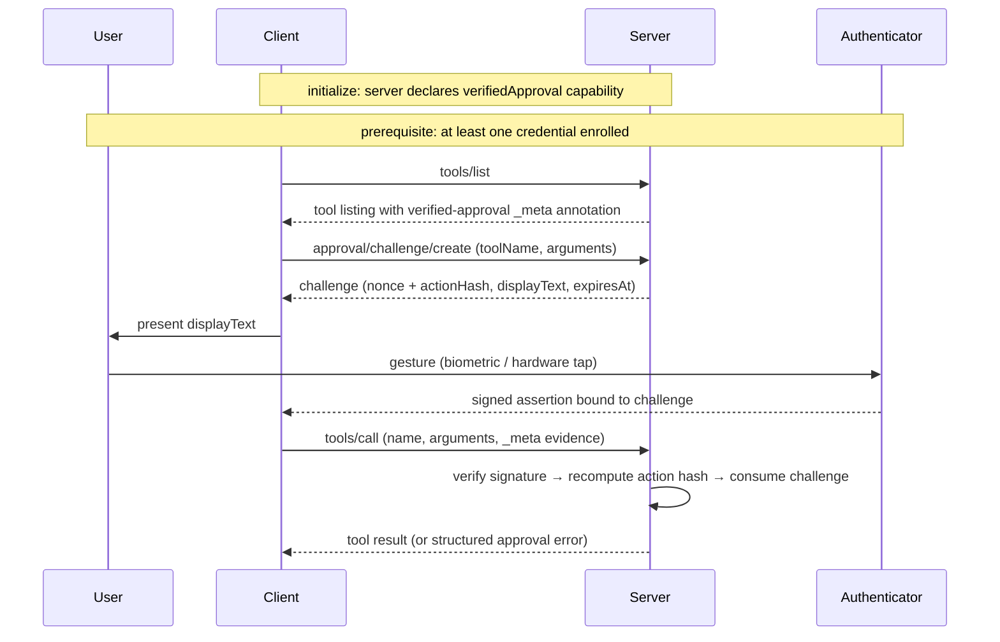

# SEP-XXXX: Verified Approval for MCP Tool Calls

```
SEP: XXXX
Title: Verified Approval for MCP Tool Calls
Author: TBD
Status: Draft
Type: Standards Track
Created: 2026-05-02
PR: TBD
Supersedes: TBD
Updates: TBD
```

## 1. Preamble

- Title, author, status (draft), type (Standards Track), created, PR number, superseded/updates fields.

## 2. Abstract

The Model Context Protocol provides advisory tool annotations and session-level authorization, but no mechanism for cryptographically verifying that a specific human consented to a specific tool invocation with specific arguments. For tool calls with high-stakes consequences — placing trades, deploying infrastructure, deleting data — a confirmation rendered by a potentially compromised client is insufficient: the same client or agent that issues the call can fabricate the approval gesture without meaningful human authorization.

This proposal introduces per-call verified approval. Tools mark themselves as requiring approval via the `_meta` annotation under the `io.modelcontextprotocol/verified-approval` key. Before invoking such a tool, the client requests a server-issued challenge whose value includes a hash of the canonicalized arguments. The user authorizes the call through a WebAuthn assertion bound to that challenge. The server independently verifies the signature, recomputes the action hash from the actual tool-call arguments, and rejects mismatches. The ceremony composes additively with existing MCP primitives: OAuth Authorization remains session-level; tool annotations remain advisory unless this proposal's annotation is present; elicitation remains the mechanism for routine and out-of-band data flows.

The proposal delivers cryptographically verified argument-binding, freshness, and single-use enforcement. It does not, on its own, defend against display-tampering attacks on synced credentials (per-call gestures may occur on the same device the client controls); the Security Implications section documents this residual risk and proposes future work. The reference implementation includes hardware-tested end-to-end ceremony, server-side verification, and a discriminated-outcome client API.

## 3. Motivation

### 3.1 The threat surface

A tool that places trades. A tool that deletes files. A tool that deploys to production. A tool that transfers money. These calls share a property: the wrong invocation is not a wrong answer the user can ignore — it is a state change that has already happened by the time anyone notices. For tools in this class, per-call human consent is reasonable.

The standard UX for that consent is a confirmation dialog rendered by the MCP client: a modal that names the tool, summarizes the arguments, and waits for a click. As an enforcement primitive, the dialog collapses under several common conditions:

- **Auto-approve modes**, where the user has pre-approved sessions of arbitrary tool use — the dialog never appears.
- **Compromised clients**, where the agent driving the LLM loop is the same process that owns the dialog and can dismiss it programmatically.
- **Prompt injection**, where a malicious tool output instructs the agent to "click yes" and the agent complies as if a user had.
- **Habitual confirmation**, where a user has clicked yes hundreds of times and clicks yes again without reading.

In each case, the client or agent that issues the call can simulate approval that the human did not meaningfully provide.

### 3.2 What MCP currently provides, and why each is insufficient

#### 3.2.1 Tool annotations (destructiveHint, etc.)

The MCP base spec defines tool annotations — `destructiveHint`, `readOnlyHint`, `idempotentHint`, `openWorldHint` — as advisory hints. The spec gives clients no obligation to surface them and no normative behavior tied to them. They are a UI affordance: a destructive-tool icon, a confirmation prompt the client may or may not render. Annotations serve their intended purpose; they are not the appropriate mechanism for the threat model this proposal addresses.

#### 3.2.2 OAuth Authorization

The MCP [authorization spec](https://modelcontextprotocol.io/specification/draft/basic/authorization) defines session-level authorization: the user authorizes the client→server connection once, the client receives an access token, and subsequent tool calls present that token. There is no per-call human-consent mechanism. Once authorized, a client can invoke any tool the server exposes any number of times without further user interaction. Authorization answers "may this client connect" — not "did the user approve this call."

#### 3.2.3 Step-up authorization

The authorization spec includes a step-up flow: a tool call may return `403` with `insufficient_scope`, prompting the client to re-authorize for additional scopes. Step-up changes the *scope* the session holds, not the *individual approvals* within it. Once stepped up to `files:write`, the client can perform any number of file writes with no further interaction. The granularity is sustained access, not single actions.

#### 3.2.4 Elicitation, form mode

The MCP [elicitation spec](https://modelcontextprotocol.io/specification/2025-11-25/client/elicitation) defines a form mode for collecting structured input from the user through the client: a username, a date range. The spec explicitly forbids form-mode elicitation for sensitive data such as passwords or credentials. Form mode is a routine-input mechanism, not an approval mechanism, and the data passes through the same client whose trustworthiness is in question.

#### 3.2.5 Elicitation, URL mode

URL-mode elicitation is the closest existing primitive. It directs the user to an external URL for sensitive interactions that "must not pass through the MCP client" — authentication redirects, payment flows, credential collection. It differs structurally from per-call approval in three ways. First, it collects information *into* the server (credentials entered into a webpage), while per-call approval collects consent *for an action out of* the server. Second, it produces no argument-binding: the resulting token is reusable across subsequent calls, with no protocol-level tie between one authorization and one tool invocation. Third, it requires the server to host an externally reachable URL, while per-call approval works for any MCP server, including stdio-only servers. The two address adjacent but distinct problems and can coexist.

### 3.3 The specific gap

The gap is precise: per-call, argument-bound, cryptographically verified human approval. Each word rules out a different existing primitive. *Per-call* rules out OAuth and step-up authorization, which grant sustained access whose granularity is the session or the scope, not the invocation. *Argument-bound* rules out URL-mode elicitation, which can authenticate a user but cannot tie the result to a specific tool call with specific arguments. *Cryptographically verified* rules out tool annotations and form-mode elicitation, neither of which produces a signature the server can check. *Human approval* rules out anything signed by the agent itself, by an automated token, or by software-only flows with no separate human gesture. No existing MCP primitive satisfies all four conditions.

### 3.4 Why it matters now

The landscape that motivates this gap has shifted. MCP servers now connect LLM agents to financial APIs, cloud infrastructure, file systems, payment processors, internal datastores, and outbound communication channels. The blast radius of a compromised agent is no longer "wrong text generated" — it is money moved, infrastructure modified, customer data deleted, messages sent under the user's identity. Prompt injection has matured into a routine operational concern: tool outputs are untrusted input, and any guidance an agent reads from a tool result is potentially adversarial. The combination of higher-stakes tools and untrusted outputs means MCP deployments increasingly operate under a threat model that includes adversarial input during autonomous execution.

The gap has been recognized in prior community discussion. Discussions #581, #594, and #668 gesture at it from different angles — questions about cryptographic approval primitives, runtime authorization for sensitive actions, and the distinction between discovery filtering and execution-time consent. A more recent proposal at #689 (Secure Model Context Protocol) addresses agent identity and capability scoping with per-call envelope signatures from the agent's ephemeral key — a complementary security primitive that does not certify human consent. SMCP and per-call human approval compose cleanly: the former proves which agent is making a call; the latter proves which human approved it. The gap — cryptographically signed approvals from the human, not the agent — has remained open through subsequent MCP security proposals.

The rest of this document defines the mechanism. The Specification section defines a tool-side annotation that marks a tool as requiring approval, a server-issued challenge whose value includes a hash of the canonicalized arguments, a WebAuthn ceremony that produces a signature bound to that challenge, and server-side verification that recomputes the action hash from the actual call and rejects on mismatch. The proposal is structurally additive: tools that do not carry the annotation behave exactly as they do today, and clients that do not implement the ceremony interact with non-annotated tools exactly as they do today. The new behavior applies only when the annotation is present.

## 4. Specification

### 4.1 Overview of the ceremony

The verified-approval ceremony binds a single tool invocation to a fresh, server-issued challenge that the user signs through a WebAuthn authenticator. This subsection describes the end-to-end flow; later subsections specify the wire formats, methods, and verification rules.

The flow assumes the server has registered at least one tool whose listing carries the verified-approval annotation (§4.2), the server has declared the `verifiedApproval` capability in its `initialize` response (§4.3), and the user has previously enrolled at least one credential through the enrollment ceremony (§4.4).

When an agent or user requests invocation of an annotated tool, the client requests a challenge from the server via `approval/challenge/create` (§4.4.3), supplying the tool name and the proposed arguments. The server canonicalizes the arguments, computes an action hash bound to `(toolName, canonicalArguments, serverId)` per §4.6, allocates a single-use challenge identifier with an expiration time, and returns a challenge envelope. The wire challenge bytes encode a fresh nonce concatenated with the action hash; the envelope additionally carries `displayText` describing the action, an `expiresAt` timestamp, and the WebAuthn `requestOptions` the client passes to the browser API.

The client presents `displayText` to the user verbatim and invokes a WebAuthn assertion. The user authenticates through whatever gesture the authenticator requires — a biometric, a hardware key tap, or equivalent — producing a signed assertion bound to the wire challenge bytes. The client then invokes `tools/call` with the original arguments and the assertion carried in `params._meta["io.modelcontextprotocol/verified-approval"]` per §4.5.

The server is the verifier. On receiving the call, the server independently performs three checks: (a) it verifies the WebAuthn signature against the credential's stored public key, (b) it recomputes the action hash from the actual call arguments and confirms it matches the hash committed to in the issued challenge, and (c) it atomically consumes the challenge so it cannot be replayed. The order matters: verification precedes consumption, so a call presenting an invalid signature does not consume the challenge it claims to bind. Only after all three checks succeed does the server execute the tool. Any failure rejects with the structured error of §4.10 and the tool is not executed.



The ceremony delivers three load-bearing properties. The signature certifies the specific canonicalized arguments (*argument-binding*), so swapping arguments between the user gesture and the server call fails verification. Challenges expire and are single-use (*freshness*), so a captured assertion cannot be reused beyond its issued challenge. The tool's declared authenticator class is enforced at enrollment and at challenge issuance (*capability filtering*). §8 documents the threat-model boundaries of these properties and the known residual risks.

### 4.2 Tool annotation: `tool._meta["io.modelcontextprotocol/verified-approval"]` shape

A server marks a tool as requiring verified approval by setting a value at the namespaced `_meta` key `"io.modelcontextprotocol/verified-approval"` on the tool's listing entry. The value has the following shape:

```typescript
interface VerifiedApprovalToolMeta {
  required: "verified";
  authenticatorClass?: "cross-platform" | "platform";
}
```

`required: "verified"` is the literal string that marks the tool as gated. `authenticatorClass`, when present, declares which class of credentials the tool accepts; the semantics of each class are specified in §4.7.

A tool listing carrying this annotation looks as follows on the wire:

```json
{
  "name": "delete_resource",
  "title": "Delete resource",
  "description": "Permanently delete the resource with the given id.",
  "inputSchema": {
    "type": "object",
    "required": ["resourceId"],
    "additionalProperties": false,
    "properties": {
      "resourceId": { "type": "string", "minLength": 1 }
    }
  },
  "_meta": {
    "io.modelcontextprotocol/verified-approval": {
      "required": "verified",
      "authenticatorClass": "cross-platform"
    }
  }
}
```

Normative requirements:

- Servers MUST set `required` to the literal string `"verified"` when the tool requires verified approval. Future versions of this specification MAY define additional values.
- The `authenticatorClass` field is OPTIONAL. When omitted, clients and servers SHOULD treat the policy as `"cross-platform"`.
- Clients MUST treat tools without this annotation as not requiring verified approval; the tool is invoked as any other tool would be, with no additional ceremony.
- Servers MAY include additional fields under the `"io.modelcontextprotocol/verified-approval"` namespace key for forward compatibility. Clients MUST NOT reject the annotation because of unknown sibling fields and MUST tolerate them.

### 4.3 Capability declaration in `initialize`

Servers that support the verified-approval extension MUST declare the capability in their `initialize` response. The capability lives under the `extensions` slot of `ServerCapabilities` at the bare key `"verifiedApproval"`:

```json
{
  "capabilities": {
    "tools": {},
    "extensions": {
      "verifiedApproval": {}
    }
  }
}
```

The capability key inside `extensions` is the bare string `"verifiedApproval"` — not the reverse-DNS form used for the `_meta` annotation key. The asymmetry between the closed `extensions` namespace and the open `_meta` namespace is documented in `docs/DECISIONS.md` ("Capability declaration placement under `extensions`"). The empty-object value is the initial declaration shape; future versions of this specification MAY define sub-fields under it.

Normative requirements:

- A server that registers any tool carrying the verified-approval annotation MUST declare this capability in its `initialize` response.
- A server MAY declare the capability without yet having registered any approval-required tool — for example, in implementations where tools are loaded dynamically post-`initialize`.
- Declaring the capability commits the server to understanding the methods defined in §4.4 (`approval/enroll/begin`, `approval/enroll/finish`, `approval/challenge/create`) and to accepting and verifying the request-side evidence shape defined in §4.5.
- Clients MUST tolerate unknown sub-fields under the capability value without rejecting the declaration.
- If a client invokes a tool whose listing carries the verified-approval annotation against a server that did not declare this capability, behavior is undefined; the inconsistency suggests a server bug. Clients MAY fail loudly or proceed at their own risk.
- If a client invokes an approval-required tool against a server that declared this capability without including evidence at `params._meta["io.modelcontextprotocol/verified-approval"]`, the server MUST reject the call with the structured error specified in §4.10.

### 4.4 New methods

#### 4.4.1 `approval/enroll/begin`

- Request/response shape, semantics.

#### 4.4.2 `approval/enroll/finish`

- Request/response shape, semantics.

#### 4.4.3 `approval/challenge/create`

- Request/response shape, semantics.

### 4.5 Evidence on `tools/call`: `params._meta["io.modelcontextprotocol/verified-approval"]`

- Where the assertion travels, what the server expects.

### 4.6 Argument canonicalization (RFC 8785) and action-hash construction

- JCS, the hash input, the hash algorithm.

### 4.7 Authenticator class policy: capability filter

- How class is checked at enrollment, not at use.

### 4.8 Server verification rules (normative MUST list)

- Bullet list of MUSTs for the server.

### 4.9 Client behavior rules (normative MUST list)

- Bullet list of MUSTs for the client.

### 4.10 Error codes and reasons

- Enumerated codes and structured reasons.

### 4.11 Security relationship to existing primitives

- Composes with OAuth Authorization, distinct from URL mode elicitation.

## 5. Rationale

### 5.1 Why `_meta` over annotations

- Advisory vs normative.

### 5.2 Why JCS for canonicalization

- Determinism, ecosystem fit.

### 5.3 Why argument-binding via challenge field, not separate field

- Reasoning.

### 5.4 Why authenticator class is a capability filter, not a use-time guarantee

- Link to the empirical mitigation-1 finding.

### 5.5 Why per-call rather than per-session

- Reasoning.

### 5.6 Why method-agnostic envelope with WebAuthn as first profile

- Reasoning.

### 5.7 Considered alternatives and why rejected

- TOTP, push notifications, OIDC step-up, plain elicitation URL mode.

## 6. Backward Compatibility

- Tools without an `io.modelcontextprotocol/verified-approval` `_meta` annotation behave identically.
- Clients without `verifiedApproval` capability cannot invoke approval-required tools — the server SHOULD reject with a structured error.
- Servers SHOULD declare the capability in `initialize`.
- Migration path: existing tools opt in by adding the annotation.

## 7. Reference Implementation

- One paragraph linking to the repo, library, demo, test suite, and verification reports.
- Note that the implementation is end-to-end working and hardware-tested.
- Note that the library API mirrors the spec's normative shape.

## 8. Security Implications

### 8.1 Threat model

#### 8.1.1 Compromised MCP client (primary)

- Description.

#### 8.1.2 Prompt injection within an honest client

- Description.

#### 8.1.3 Network-layer attackers

- Covered by transport TLS.

#### 8.1.4 Compromised authenticator

- Hardware-rooted defense.

#### 8.1.5 Malicious server

- Out of scope; the user trusts the server they chose.

### 8.2 Properties delivered (with reasoning)

#### 8.2.1 Argument-binding via the challenge construction

- Reasoning.

#### 8.2.2 Freshness via per-call nonce and TTL

- Reasoning.

#### 8.2.3 Single-use via server-side atomic consume

- Reasoning.

#### 8.2.4 Capability filtering via authenticator class

- Reasoning.

### 8.3 Residual risks

#### 8.3.1 Display tampering for synced credentials

- The empirical finding; link to `verification/phase-4-mitigation-1.md`.

#### 8.3.2 Counter-zero credentials

- Apple synced passkey case; cloning detection degraded.

#### 8.3.3 Social engineering of the user gesture

- Out of protocol scope.

#### 8.3.4 Recovery flow

- Lost authenticator — implementation-defined.

### 8.4 Future Work / open spec questions

#### 8.4.1 Per-assertion transport observability

- Notes.

#### 8.4.2 Out-of-band confirmation channels

- Notes.

#### 8.4.3 Multi-party countersignature

- Notes.

#### 8.4.4 Headless agent contexts

- Delegated approval sessions.

<!-- No appendices in v1. Test vectors live in the reference implementation. -->
